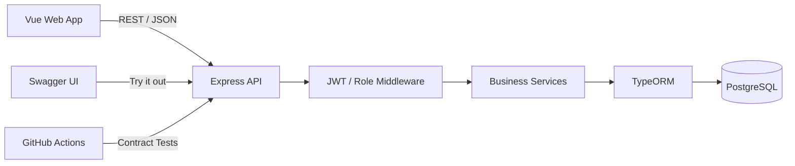

# FitConnect 健身課程預約平台

FitConnect 是一套健身教練媒合與課程預約平台。使用者可以註冊、購買點數方案、瀏覽教練與課程並完成預約；教練則能管理個人資料、課程與月營收。專案重點不是單純 CRUD，而是把身分驗證、角色權限、點數計算、名額控制與取消紀錄整合成可執行的商業流程。

> 這是我目前最完整的後端作品，適合從「API 設計、資料模型、交易一致性、測試與容器化」五個面向進行面試說明。

## 我負責的內容

- 依 OpenAPI 規格實作 Express REST API
- 設計 PostgreSQL / TypeORM 實體與關聯
- 實作 JWT 驗證、密碼雜湊與 USER / COACH 角色權限
- 實作課程預約、取消、點數餘額與名額限制
- 使用 transaction 與 pessimistic lock 降低同時預約造成的超賣風險
- 建立 Dockerfile、Docker Compose、健康檢查與 GitHub Actions 測試流程
- 串接既有 Vue 前端並維護 Swagger API 文件

## 技術棧

| 分類 | 技術 |
| --- | --- |
| Backend | Node.js、Express 5、JavaScript |
| Database | PostgreSQL 16、TypeORM、EntitySchema |
| Security | JWT、bcrypt、role-based authorization |
| API | REST、OpenAPI / Swagger UI |
| Testing | Jest、Supertest，共 68 個 API / contract tests |
| DevOps | Docker、Docker Compose、GitHub Actions、healthcheck |
| Frontend | Vue 3、Vite（課程提供的前端介面） |

## 系統架構



Docker Compose 會啟動四個服務：Vue 前端、Express API、Swagger UI 與 PostgreSQL。API 的 `/healthcheck` 不只確認程序存活，也會實際查詢資料庫。

## 核心功能

### 會員與權限

- 註冊、登入、個人資料與密碼修改
- bcrypt 雜湊密碼；登入後簽發有期限的 JWT
- JWT middleware 驗證 token，並重新查詢使用者狀態
- USER / COACH 權限檢查

### 教練與課程

- 將一般使用者升級為教練
- 編輯教練介紹、年資與技能
- 新增、查詢與修改課程
- 公開瀏覽教練、技能及進行中課程
- 依月份彙整教練營收、參與人數與課程數

### 點數與預約規則

- 購買點數方案並保留購買當下的點數與價格快照
- 預約前檢查課程、重複預約、剩餘點數與課程名額
- 預約流程使用資料庫 transaction，並對使用者與課程加上 pessimistic write lock
- 取消採 `cancelled_at` 軟刪除，保留歷史紀錄
- 會員可查看剩餘點數、已使用點數與所有預約

## API 摘要

完整 request / response schema 請見 [`docs/openapi.yaml`](docs/openapi.yaml)，啟動後也可以在 Swagger UI 直接測試。

| Domain | 代表性端點 | 權限 |
| --- | --- | --- |
| Auth | `POST /api/users/signup`、`POST /api/users/login` | 公開 |
| User | `GET /api/users/profile`、`PUT /api/users/password` | JWT |
| Credit | `GET /api/credit-package`、`POST /api/credit-package/:id` | 部分需 JWT |
| Coach | `GET /api/coaches`、`PUT /api/admin/coaches` | 公開 / COACH |
| Course | `GET /api/courses`、`POST /api/admin/coaches/courses` | 公開 / COACH |
| Booking | `POST /api/courses/:id`、`DELETE /api/courses/:id` | JWT |

## 快速啟動

需求：Docker Desktop，以及可執行 Docker Compose 的環境。

```bash
docker compose up -d --build
```

啟動完成後：

- 前端：<http://localhost:3000>
- API：<http://localhost:8080>
- Swagger UI：<http://localhost:8081>
- 健康檢查：<http://localhost:8080/healthcheck>

查看服務狀態與日誌：

```bash
docker compose ps
docker compose logs -f backend
```

停止服務：

```bash
docker compose down
```

## 本機開發

只在 Docker 中啟動 PostgreSQL：

```bash
docker compose up -d postgres
copy .env.example backend/.env
npm --prefix backend install
npm --prefix backend run dev
```

macOS / Linux 可將 `copy` 改成 `cp`。

## 測試與 CI

先確認 PostgreSQL 與 backend 已啟動，再於專案根目錄執行：

```bash
npm install
npm test
```

測試分成六個 milestone 與一組容器 smoke test，涵蓋技能、方案、帳號、教練、課程、預約、點數及營收流程。GitHub Actions 會在 push 到 `main` 時建立 PostgreSQL service、啟動 API，並逐組執行 contract tests；另一個 job 會驗證 Docker 映像與資料持久化。

## 關鍵設計決策

1. **預約放在 transaction 中**：點數與名額是同一個商業動作，不能只檢查後直接寫入。
2. **使用 pessimistic lock**：同一位會員或同一堂課出現平行請求時，避免兩個請求同時通過檢查。
3. **取消採軟刪除**：保留使用者與課程歷史，統計時再排除 `cancelled_at` 不為空的紀錄。
4. **購買資料保留快照**：方案日後改價時，歷史交易仍保有當時的價格與點數。
5. **健康檢查包含 DB query**：應用程式能接 HTTP 不代表資料庫可用，`SELECT 1` 能提供較可靠的 readiness 訊號。

## 已知限制與後續改善

- 目前為課程專案，尚未部署到正式雲端環境。
- 管理端的建立技能、方案與升級教練 API 還需要補上 ADMIN 角色授權。
- 可再加入 request schema validator、rate limiting、結構化 logging 與集中式監控。
- 生產環境應使用 migration 取代 `DB_SYNCHRONIZE=true`，並由 secret manager 管理敏感設定。
- 預約表可增加資料庫層級的唯一條件，讓應用鎖與 DB constraint 形成雙重保護。

面試時的 60 秒介紹、架構追問與改善方向整理在 [`docs/INTERVIEW_GUIDE.md`](docs/INTERVIEW_GUIDE.md)。

## 專案來源與貢獻說明

此專案源自六角學院 Node.js 課程最終作業；前端、API 規格與驗收測試由課程提供，`backend/` 內的 API、資料模型與商業邏輯為我的實作。我保留這段說明，讓面試官能清楚區分題目素材與我的貢獻。
